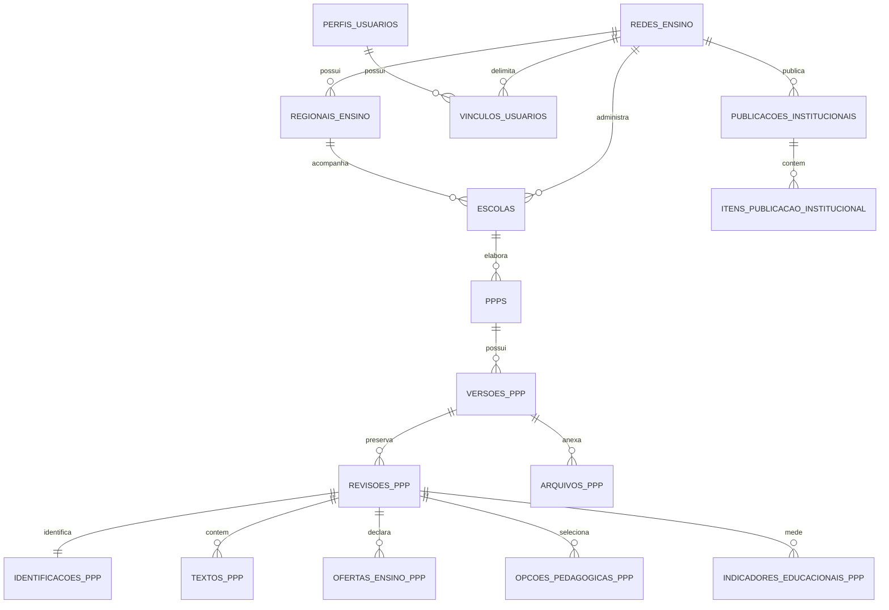

# Arquitetura de dados do Gerador de PPP

## Decisoes adotadas

O sistema usa Supabase com PostgreSQL, Auth, RLS e Storage privado. O banco e organizado em tabelas com nomes em portugues, no plural e em `snake_case`. Cada tabela tem uma responsabilidade clara. As migrations em `supabase/migrations` sao a fonte de verdade e sao aplicadas em ordem.

A referencia visual e funcional e `Gerador de PPP V6.5/Gerador de PPP v10.2/Gerador de PPP.html`. Ela permanece imutavel. A aplicacao usa uma copia de trabalho gerada e um adaptador externo para o Supabase.

## Convencoes

| Regra | Padrao |
| --- | --- |
| Tabelas | substantivo plural em portugues: `versoes_ppp` |
| Chaves primarias | `id` UUID |
| Chaves estrangeiras | nome da entidade no singular seguido de `_id` |
| Datas | sufixo `_em`, tipo `timestamptz` |
| Exclusao logica | `arquivado_em`, `removido_em` ou `revogado_em` |
| Situacoes e papeis | texto com `check`, para evoluir por migration |
| Identidade de documento | `ppps` nunca muda; versoes e revisoes sao registros separados |

## Entidades e relacionamentos

## Grupos de tabelas

| Dominio | Tabelas | Finalidade |
| --- | --- | --- |
| Organizacao | `redes_ensino`, `regionais_ensino`, `escolas` | Estrutura administrativa e vinculo territorial. Triggers impedem regional ou escola de outra rede. |
| Usuarios e acessos | `perfis_usuarios`, `vinculos_usuarios`, `provisionamentos_acesso` | Identidade vinda do Auth, papel por escopo e convite antes do primeiro login. |
| Documento PPP | `ppps`, `versoes_ppp`, `revisoes_ppp`, `progresso_ppp` | Documento permanente, versao formal, revisao editavel e ponto de retomada. |
| Respostas PPP | `identificacoes_ppp`, `textos_ppp`, `ofertas_ensino_ppp`, `opcoes_pedagogicas_ppp`, `indicadores_educacionais_ppp`, `detalhes_ppp`, `tarefas_revisoes_ppp` | Cada resposta do formulario fica estruturada e ligada a uma revisao. |
| Evidencias | `participantes_ppp`, `arquivos_ppp`, `eventos_ppp` | Pessoas, metadados de arquivos privados e historico do documento. |
| Conteudo institucional | `catalogos`, `itens_catalogo`, `publicacoes_institucionais`, `itens_publicacao_institucional`, `rascunhos_conteudo_institucional`, `configuracoes_redes` | Catalogos e conteudo editavel, rascunho por curador e publicacao imutavel. |
| Administracao central | `lotes_importacao_escolas`, `linhas_importacao_escolas`, `eventos_auditoria` | Importacao validada antes de aplicar e rastreabilidade de operacoes relevantes. |

## Onde as respostas do formulario sao salvas

| Tipo de resposta | Destino |
| --- | --- |
| Dados conhecidos de identificacao | `identificacoes_ppp` |
| Textos longos por secao | `textos_ppp` |
| Etapas, modalidades e opcoes selecionadas | `ofertas_ensino_ppp` e `opcoes_pedagogicas_ppp` |
| Indicadores e anos de referencia | `indicadores_educacionais_ppp` |
| Campos condicionais e ainda mutaveis | `detalhes_ppp`, com `grupo` e `campo` claros |
| Tarefas e tela de retorno | `tarefas_revisoes_ppp`, `tarefas_progresso_ppp` e `progresso_ppp` |

Nenhuma resposta de revisao do PPP fica guardada como JSONB. JSONB e usado somente nos parametros e retornos das RPCs, e no valor de conteudo institucional que pode variar de formato sem alterar o schema do formulario. Esse conteudo e sempre versionado por publicacao.

## Ciclo de vida do PPP

1. A escola cria `ppps`, `versoes_ppp` numero 1 e `revisoes_ppp` numero 1 em uma transacao.
2. Cada salvamento cria uma nova revisao e atualiza somente o ponteiro `revisao_atual_id`.
3. A conclusao congela a revisao prevista pelo fluxo e impede alteracao do rascunho.
4. Uma mudanca posterior abre nova versao do mesmo PPP. Versoes concluidas, assinadas e homologadas nunca sao sobrescritas.
5. O arquivo PDF fica no Storage privado; `arquivos_ppp` guarda somente metadados, hash e caminho privado.

## Seguranca

- Supabase Auth gere senha, sessao e login Google; o banco nao armazena senha.
- RLS permanece habilitada em tabelas expostas ao cliente.
- RPCs `security definer` usam `auth.uid()` e validam papel e escopo antes da operacao.
- A chave anon pode estar no frontend. `service_role`, senha PostgreSQL, tokens de provedor e segredos ficam fora do Git e do navegador.
- Provisionamentos podem ser usados, revogados ou reativados. Reenvio apenas registra uma solicitacao auditavel; envio real de e-mail exige integracao protegida.

## Contratos principais

| Area | RPCs |
| --- | --- |
| PPP | `criar_rascunho_ppp`, `salvar_rascunho_ppp`, `obter_ppp_por_protocolo`, `concluir_ppp` |
| Consulta central | `obter_cobertura_rede_ppps`, `listar_ppps_orgao_central`, `consultar_ppp_orgao_central` |
| Acessos | `listar_vinculos_rede`, `listar_provisionamentos_acesso`, `salvar_provisionamento_acesso`, `revogar_vinculo_rede`, `revogar_provisionamento_acesso` |
| Escolas | `salvar_escola_rede`, `criar_lote_importacao_escolas`, `aplicar_lote_importacao_escolas` |
| Conteudo | `abrir_curadoria_conteudo`, `salvar_rascunhos_curadoria`, `descartar_rascunhos_curadoria`, `publicar_conteudo_institucional` |

## Migrations

- `20260922000100` a `20260922002300`: fundacao, formulario estruturado, retomada, PDF, catalogos e dados da versao 10.2.
- `20260922002400` a `20260922002600`: sincronizacao de login Google e contexto institucional seguro.
- `20260922002700` a `20260922003000`: base do Orgao Central, curadoria e consultas centralizadas.
- `20260922003100`: ciclo de convites e validacao de escopo entre rede, regional e escola.
- `20260922003200`: cadastro e importacao auditavel de escolas.
- `20260922003300`: historico, descarte e primeira publicacao de conteudo institucional.

A migration inicial recria o schema `public` e so serve para projeto vazio. Para evoluir um ambiente ja utilizado, sempre acrescente uma nova migration.
