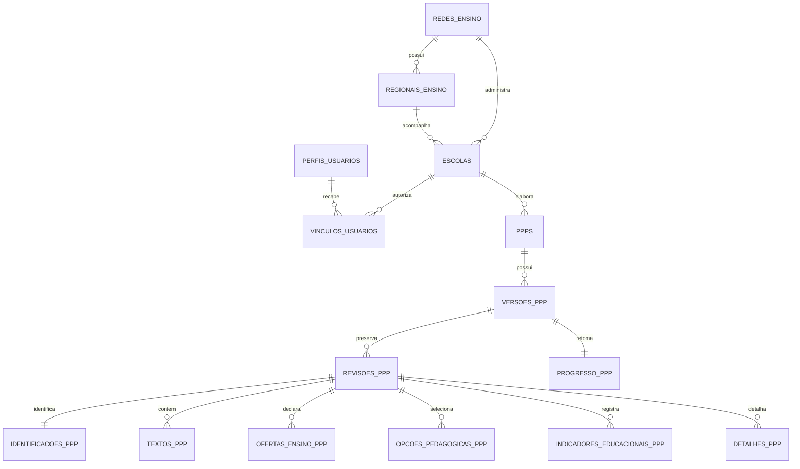

# Arquitetura de dados — Gerador de PPP

## Decisão atual

O ambiente de desenvolvimento usa Supabase: PostgreSQL, Supabase Auth, Row Level Security (RLS) e Supabase Storage privado. A persistência não tem colunas JSON ou JSONB permanentes. O navegador usa JSON somente no transporte das RPCs porque o protótipo entrega um objeto de formulário; a função do banco o divide em linhas tipadas antes de gravar.

A referência visual e funcional permanece em `Gerador de PPP V6.5/Gerador de PPP v6.5.html`. Ela não é a aplicação em desenvolvimento e não recebe alterações. A cópia de trabalho é gerada por `apps/web/scripts/prepare-reference.mjs` e recebe o adaptador externo em `apps/web/src/runtime/prototype-adapter.ts`.

## Convenções

- Tabelas: substantivos no plural, em português (`versoes_ppp`).
- Chave primária: `id` UUID.
- Chave estrangeira: termina em `_id`.
- Datas: terminam em `_em` e usam `timestamptz`.
- Situações e papéis: texto em português com `check`, pois poderão evoluir por migration sem dependência de enum.
- O registro documental não é apagado fisicamente. Usa-se situação, revogação ou `removido_em`.

## Modelo relacional

## Onde cada grupo do formulário é gravado

| Dado do protótipo | Tabela | Forma de leitura |
| --- | --- | --- |
| Identificação, equipe, vigência, quórum e homologação | `identificacoes_ppp` | Uma linha por revisão, com coluna nomeada para cada dado conhecido. |
| Textos pedagógicos `tApresentacao` a `tConvivencia` | `textos_ppp` | Uma linha por seção; a chave da seção permanece estável mesmo quando um texto for incluído depois. |
| Etapas e modalidades | `ofertas_ensino_ppp` | Uma linha por opção escolhida. |
| Infraestrutura, temas, princípios e métodos | `opcoes_pedagogicas_ppp` | Uma linha por opção escolhida. |
| Indicadores gerais e por etapa | `indicadores_educacionais_ppp` | Uma linha por indicador, etapa e revisão. |
| Campos condicionais de modalidades e balanço | `detalhes_ppp` | Uma linha por campo; `grupo` dá o contexto e `campo` a identificação. |
| Tarefas da preparação | `tarefas_revisoes_ppp` e `tarefas_progresso_ppp` | Histórico por revisão e estado atual para retomada. |

## Ciclo de vida

`ppps` é a identidade permanente do documento. Cada atualização cria uma linha em `revisoes_ppp`; esta linha recebe todas as respostas relacionadas. `versoes_ppp.revisao_atual_id` aponta para a revisão que está em edição. Uma versão concluída, assinada ou homologada será congelada em incremento posterior e nunca será sobrescrita; uma alteração então abrirá nova versão do mesmo PPP.

## Segurança

Supabase Auth é a única fonte de senha e sessão. `perfis_usuarios` apenas espelha o identificador e dados mínimos do usuário. `vinculos_usuarios` limita o escopo a escola, regional ou rede. RLS está habilitada nas tabelas protegidas; criação, salvamento e retomada passam pelas RPCs `criar_rascunho_ppp`, `salvar_rascunho_ppp` e `obter_ppp_por_protocolo`, que validam `auth.uid()` e o vínculo antes de operar. A chave pública pode estar no navegador; `service_role`, senha PostgreSQL e tokens administrativos não podem.

## Migrations ativas

1. `20260922000100_base_inicial.sql`: base limpa, organizações, identidades, conteúdo, PPP, histórico, RLS e RPCs.
2. `20260922000200_completar_mapeamento_formulario.sql`: indicadores por etapa e detalhes condicionais.
3. `20260922000300_retomada_formulario_estruturada.sql`: campo de compartilhamento e reconstrução do formulário para retomada.

As migrations anteriores foram preservadas somente em `supabase/legado/migrations/`; não são aplicadas. A primeira migration limpa o schema `public`, portanto só pode inicializar um projeto vazio de desenvolvimento ou homologação. Nunca a execute sobre um ambiente com dados que precisem ser preservados.

## Prévia do documento

A prévia usa o HTML exato já montado pelo protótipo. Antes de abrir a janela de impressão, o adaptador salva uma nova revisão no Supabase. O navegador então permite imprimir ou salvar como PDF. Prévia é transitória: não cria arquivo em Storage nem linha em rquivos_ppp; o documento final congelado será armazenado somente no fluxo de conclusão.

## Próximos domínios

Assinaturas, convites, atas, anexos, homologação e curadoria já têm tabelas-base quando aplicável, mas seus fluxos não estão liberados. Storage continuará guardando objetos privados; o banco guardará somente metadados, hash e vínculo com a versão.