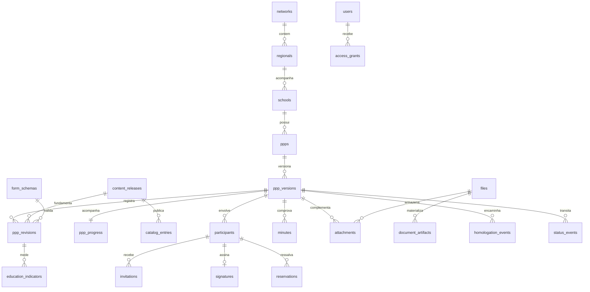
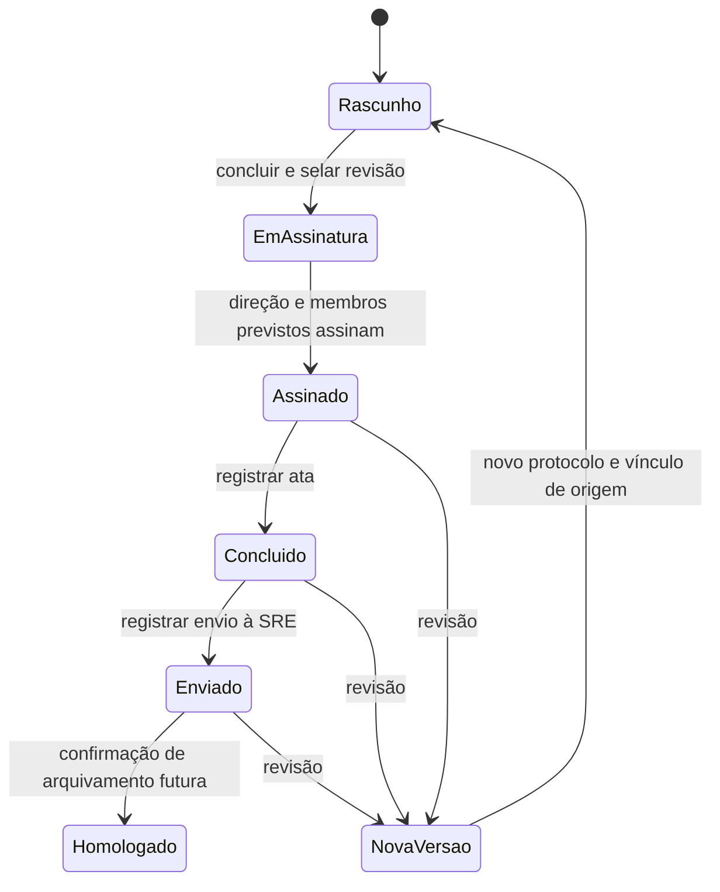

# Gerador de PPP — diagnóstico e proposta de persistência

Data: 21/09/2026. Estado: diagnóstico concluído; Supabase escolhido como plataforma. A fundação está implementada em migrations locais; a conexão pública do projeto remoto foi validada, mas nenhuma migration foi aplicada remotamente.

## Baseline implementada no Supabase

As migrations em `supabase/migrations/` são a especificação executável da primeira etapa e prevalecem sobre a proposta exploratória mais detalhada deste documento. O modelo deliberadamente reduz o número de conceitos: `memberships` substitui a separação de papéis e grants; `network_settings` é o ponteiro da publicação ativa; `workflow_events` concentra o histórico de transições; `files` guarda somente metadados de objetos privados; e indicadores, textos, seleções e detalhes do formulário ficam no `answers` JSONB de uma revisão.

O banco inicial contém organizações (`networks`, `regionals`, `schools`), identidade e escopo (`profiles`, `memberships`), conteúdo e catálogos (`content_releases`, `network_settings`, `catalogs`, `catalog_options`) e o domínio documental (`ppps`, `ppp_versions`, `ppp_revisions`, `ppp_progress`, `participants`, `files`, `workflow_events`, `audit_events`). Isso preserva integridade onde há relação entre entidades e evita transformar cada pergunta pedagógica mutável em coluna.

As RPCs `create_ppp_draft` e `save_ppp_draft` já preservam o contrato do adaptador do HTML: cada salvamento gera uma nova revisão, usa a publicação institucional ativa e verifica revisão otimista. Assinatura, atas, anexos, homologação, curadoria e administração de acessos ainda são incrementos próprios; não foram simulados como concluídos.

## 1. Evidências e limites da análise

Leitura integral do HTML, incluindo CSS, marcação, conteúdo pedagógico, renderizadores, simulador, contratos e eventos. O workspace inicial contém apenas:

| Arquivo | Resultado |
| --- | --- |
| `Gerador de PPP V6.5/Gerador de PPP v6.5.html` | 450.696 bytes, 5.760 linhas; única implementação encontrada |
| `Supabase pass.txt` | Lido localmente sem reproduzir seu conteúdo; tratado como segredo, não como configuração ou autorização de conexão |

SHA-256 do HTML analisado: `D1CA5C872368379C1A0DC8F9BC4C70BA45CE3D0EBB47DFE9BF416178A43C2DED`.

Não há README, AGENTS.md, `.git`, `.env`, manifesto de dependências, scripts, testes, migrations, servidor, `Code.gs` ou projeto Supabase. Não foram encontrados AGENTS.md nos diretórios ancestrais verificados. A segunda aba do IDE com HTML na raiz não corresponde a um arquivo presente no disco. O rodapé declara v6.4, embora o arquivo seja v6.5. Git, Node, npm, Docker e psql não foram encontrados no PATH; há somente um executável/alias de Python, cuja capacidade não foi validada. Não há histórico Git local para consultar.

Referências de linhas abaixo apontam para o HTML original. A declaração de backend no rodapé e os comentários sobre Drive e planilhas demonstram intenção; não comprovam uma implantação existente. A existência de `Supabase pass.txt` não confirma projeto, região, plano, schema, autenticação ou armazenamento. Nenhuma credencial foi usada, copiada para documentação ou transmitida.

## 2. Arquitetura atual

Aplicação de página única monolítica. HTML/CSS apresentam o percurso; JavaScript mantém estado, valida informalmente, monta o documento e chama `servidor(fn, args, ok, erro)` (linha 2429).

O transporte escolhe automaticamente entre `google.script.run` e `simuladorLocal`, pela presença do objeto Google. Não há HTTP/fetch, persistência em localStorage, sessionStorage ou IndexedDB. Fora de Apps Script, o bootstrap aplica dados fictícios automaticamente, inclusive uma versão 2. Recarregar a página perde alterações.

Existem 10 módulos e **38 telas declaradas**: `t00`, `t01`, `tBal`, `t02` a `t26`, `tConvF`, `tConv`, `t27`, `t28`, `tProf`, `t29` a `t33`. A primeira versão tem 37 telas visíveis; revisão tem 38. O texto do mapa ainda anuncia 34. A barra representa posição no percurso; o checklist mede preenchimento por outro critério. Não confundir nenhum deles com estado documental.

O documento contém identificação, apresentação, seções 1–21 e previsão de folha de assinaturas 22 gerada no servidor ausente. `docHTML` combina respostas com catálogos e textos institucionais. A interface envia esse HTML ao backend para prévia e conclusão; ele não deve se tornar fonte confiável no servidor.

### Perfis observados

| Ator | Comportamento atual | Necessidade no destino |
| --- | --- | --- |
| Escola/direção | Inicia e retoma por protocolo; preenche, conclui, assina, convida e registra documentos | Identidade autenticada e vínculo explícito com escola |
| Regional | Consulta documentos da própria SRE e exporta painel | Leitura limitada à regional; confirmação de homologação ainda não implementada |
| Órgão Central | Consulta a rede; edita/publica conteúdo; administra acessos regionais e centrais | Permissões separadas de consulta, curadoria e administração |
| Membro do Colegiado | Previsto por link individual `?t=...`, assinatura e ressalva | Acesso restrito a uma versão e participante; não equivale a usuário editor da escola |
| Administrador/curador Google | Flags `admin`, `curador`, `curadoria`, `senhaDefinida`, `controleAtivo` | Capacidades derivadas de autorização; não aceitar flags do cliente |

`SESSAO.perfil='escola'` é previsto, mas a porta escolar não efetua login explícito. Nome, MASP, e-mail e protocolo não comprovam identidade. A sessão de edição `APP.sessao` também não é autenticação.

## 3. Inventário completo de estado local e destino

| Origem atual | Dados/limitações | Destino proposto |
| --- | --- | --- |
| `APP.local`, `sujo`, flags de interface | Transporte e feedback visual | Permanecem no cliente; configuração explícita de demo/API |
| `APP.sessao` | Identificador aleatório de aba; aviso de concorrência | Identificador de editor opcional; revisão otimista no banco, nunca credencial |
| `APP.protocolo`, `versao`, `origem`, `status` | Identificação e cadeia documental | `ppps`, `ppp_versions`, `workflow_states`, `status_events` |
| `APP.hash`, `concluidoEm`, `pdfUrl` | Hash fictício e URL vazia no demo | Snapshot selado, digest real e `document_artifacts` |
| `APP.assinaturas` | Pessoas, papéis, segmentos, MASP, e-mail, token, data, ressalva | `participants`, `invitations`, `signatures`, `reservations`; não retornar tokens portadores |
| `APP.ata*`, `anexos`, `homol*` | Metadados e URLs `#` no demo | `minutes`, `attachments`, `files`, `homologation_events` |
| `APP.objetivosAnteriores`, `indicadoresAnteriores` | Cópias textuais/JSON para balanço | Ler revisão selada da versão anterior; adapter gera os campos legados |
| `state.tela` | Índice numérico da tela | `ppp_progress.screen_key`, vinculado à versão do formulário |
| `state.sel` | Seis conjuntos de IDs; rótulos duplicados no payload | Seleções JSONB validadas contra catálogo da publicação; associações relacionais de oferta quando necessárias |
| `state.det` | Detalhes EFTI, EMTI, EPT | Respostas JSONB sob schema versionado |
| `state.ind` | Ano, IDEB AI/AF e ano, PROALFA, PROEB, clima, AEE, docentes e linhas por etapa | Medidas tipadas em `education_indicators`; notas qualitativas no JSONB |
| `state.tarefas` | Booleanos por `índiceTela:índiceItem` | `ppp_progress.tasks` JSONB com IDs estáveis e schema; migração explícita dos índices |
| `state.dados` | Identificação, vigência, datas, quórum, pessoas e compartilhamento | Escola relacional; identificação histórica no snapshot; eventos formais relacionais |
| `state.txt` | 36 campos narrativos, incluindo balanço e dois opcionais | Respostas JSONB versionadas; sem uma coluna por texto |
| `SESSAO` | Token, perfil, SRE, nome, modo, porta em memória | Provedor de identidade + vínculos/permissões; modo/porta permanecem locais |
| `CONTEUDO` | Versão, diferenças, ocultos, padrões servidor e prévia | Publicação imutável e ponteiro ativo; prévia local |
| `CUR` | Token, autor, rascunhos, pendentes, histórico, mapa, filtros | Rascunho persistido com revisão e autoria; histórico/auditoria; mapa e filtros locais |
| `PADRAO`, `RAIZES`, `GRUPOS` | Base embarcada e referências vivas | Pacote de conteúdo/formulário versionado; compatibilidade de caminhos |
| `EDICAO`, `PAINEL`, `ACESSOS` | Modo editorial e caches de consultas | Modo/cache no cliente; dados fornecidos por consultas autorizadas |
| `REGISTROS_DEMO` | 11 linhas fictícias, percentuais/assinaturas/ressalvas e vencimento prontos | Consulta agregada de versões, participantes, assinaturas e eventos; sem seed dessas escolas |
| `ACESSOS_DEMO` | Dois acessos fictícios, sem autenticação real | Usuários individuais e vínculos; sem seed de contas/e-mails/senhas |
| `aplicarDemo()` | Escola/pessoas fictícias, seleções, dois textos, indicadores atuais/anteriores e origem | Fixture exclusiva do demo/testes; nunca seed de produção |
| `regDemo()` | Reaproveita o estado da escola aberta para fabricar registros | Repositório monta DTO a partir da versão solicitada |
| `simuladorLocal()` | Espera 600 ms e devolve sucessos sem gravação | Casos de uso transacionais; demo permanece disponível |
| `ataBase64`, `anexoB64`, MIME/nome | Arquivos inteiros em memória | Upload privado e metadados; buffer transitório, nunca coluna base64 |
| Zoom, timers, DOM, linhas de membros não enviadas | Estado de apresentação/edição temporária | Permanecem locais; distinguir claramente enviado de não enviado |

### Campos escolares identificados

`dados`: escola, inep, municipio, sre, direcao, especialista, endereco, ato, turnos, estudantes, turmas, colegiado, vigencia, assembleia, analiseSre, aprovacao, quorumPresentes, quorumTotal, homologacao e compartilhado. Os dois últimos não têm fluxo de edição funcional claramente conectado; não convertê-los silenciosamente em permissões.

`txt`: tApresentacao, tHistorico, tEtapas, tModalidades, tComunidade, tEstudantes, tInfraestrutura, tDiagnostico, tPrincipios, tMissao, tObjetivos, tCurriculo, tTemas, tMetodologias, tAvaliacao, tInclusiva, tEtnico, tDigital, tProtagonismo, tFamilia, tFormacao, tGestao, tProjetos, tPlanoAcao, tAcompanhamento, tReferencias, tBalanco, tJustificativa, tOrganizacaoTrabalho, tAceleracao, tComunicacaoFamilias, tArticulacao, tDecisorio, tAvaliacaoInstitucional, tOutrosAspectos e tConvivencia. São 36 chaves declaradas; os IDs são a referência, não uma quantidade fixa.

`ind.etapas[etapa]`: `mat`, `apr`, `rep`, `aba`, `dis`. Entradas atualmente são strings; vírgula decimal é aceita por `parseFloat`, sem validação estrita de faixa. PROALFA/PROEB/clima são texto livre, não medidas comparáveis sem interpretação.

### Conteúdo configurável, não respostas da escola

`REDE` (nomes e referência normativa pendente), `SRES` (47 nomes a conferir), `VIDEOS` (17 pautas sem URLs preenchidas), `ETAPAS` (4), `MODALIDADES` (13), `INFRA` (12), `TEMAS` (11), `PRINCIPIOS` (14), `METODOS` (11), `DETALHES`, `MODULOS`, `TELAS`, `T`, `UI`, `SECOES`, `SUBSECOES`, `ABERTURAS`, `VAZIOS`, `REF_LEGISLACAO`, `REF_COND`, `SEGMENTOS` (5), `IND_COLS`, `IND_ALERTA`, rótulos/referências de `CHECK` e `PADROES_SERVIDOR_DEMO`.

`REFS` institucionais também são parcialmente geradas por `refsInstitucionais()`. `TIPO_ROTULO`, mapas de seção/campo e rotuladores de curadoria são metadados de apresentação. As funções de validação de `CHECK` não são conteúdo editável: alterar seu texto não altera a regra.

## 4. Contratos de backend encontrados

São **25 operações** no simulador e nos pontos de chamada, incluindo duas adicionais de curadoria não citadas no pedido. O contrato é inferido do consumidor e do simulador; não é uma especificação validada contra servidor real.

`D` abaixo é `coletarDados()` (linha 4013): protocolo, tela, todos os campos de dados/textos, arrays de rótulos dos seis grupos, strings JSON de indicadores/detalhes/selecoes/tarefas, objetivos/indicadores anteriores e sessao. `R` é esse registro acrescido de versão, origem, status, datas, hash, pdfUrl, ata*, homol*, assinaturas/anexos serializados. Respostas usam geralmente `{ok, erro}`; contexto e conteúdo são exceções. Erros de transporte seguem callback separado.

| Operação | Entrada observada | Saída consumida / responsabilidade real |
| --- | --- | --- |
| salvarPPP | `D + status`; opcional `ignorarDuplicado` | ok, protocolo, versao, atualizadoEm; erro ou duplicado {protocolo, escola, atualizadoEm}; gravar rascunho autenticado |
| buscarPPP | `{p, sessao}` | ok, registro R; ocupado {desde, minutos}; autorização antes de revelar existência |
| contexto | null | email, admin, controleAtivo, urlApp, curadoria, curador, senhaDefinida, acessoInstitucional |
| previaPDF | `D + docHtml` | ok, base64, nomeArquivo; simulado no demo; gerar artefato sem transição |
| concluirPPP | `D + docHtml + assinaturaDirecao {nome,masp,email}` | ok, registro R; snapshot e abertura de assinaturas |
| assinarDirecao | `{p,pessoa:{nome,masp,email}}` | ok, registro R; identidade/aceite/versão verificados no servidor |
| adicionarMembros | `{p,membros:[{nome,masp,email,segmento}]}` | ok, convidados, falhas[], registro R; participantes e convites |
| registrarAta | `{p,base64,nome,mime,dataReuniao,identificacao}` | ok, registro R; data enviada em dd/mm/aaaa; registro documental |
| registrarAnexo | `{p,base64,nome,mime}` | ok, registro R; upload autorizado |
| registrarHomologacao | `{p,destino}` | ok, registro R; somente evento de envio demonstrado |
| conteudoPublicado | null | versao, itens, padroes; carregar publicação ativa |
| entrarInstitucional | `{email,senha,nome,masp,perfilDemo}` | ok, token, perfil, sre, nome; ignorar perfilDemo em produção |
| painelRegistros | `{token,filtros:{sre,status,vencidas,busca}}` | ok, perfil, sre, nome, linhas[], sres[]; paginação futura |
| registroLeitura | `{token,p}` | ok, registro R; consulta sem adquirir trava de edição |
| novaVersao | **string** protocolo | ok, registro R; copiar conteúdo, vincular origem e preservar versão anterior |
| curadoriaAbrir | `{token}` | ok, autor, rascunhos, pendentes, historico, padroesServidor |
| curadoriaEntrar | `{senha,nome,masp}` | dados de abertura + token; caminho legado de autenticação |
| curadoriaSalvar | `{token,alteracoes:[{p,valor,rot}]}` | ok, pendentes; null solicita restauração do padrão |
| curadoriaPublicar | `{token}` | ok, itens, versao, historico; publicação atômica |
| curadoriaDescartar | `{token}` | ok, pendentes; descartar apenas rascunho |
| acessosListar | `{token}` | ok, acessos [{email,nome,perfil,sre,situacao,ultimoAcesso,comSenha}] |
| acessoSalvar | `{token,nome,email,perfil,sre,senha,situacao}` | ok, acessos; criação/alteração de vínculo e credencial legada |
| acessoRemover | `{token,email}` | ok, acessos; revogação de acesso, sem apagar histórico |
| reenviarConvite / removerMembro | `{p,token}` | ok, registro opcional; token aqui identifica convite, não sessão |

Contagem: a última linha representa duas operações; a tabela contém 25 nomes. A lista literal do simulador é a referência para os testes de contrato.

Não há implementação/chamada nesta página para efetivar assinatura de membro, registrar/responder ressalva, confirmar arquivamento pela DIRE, validar link, revogar sessão no servidor ou consultar publicamente autenticidade. Há somente intenção textual e link `?t=`; novos contratos precisarão ser definidos. CSV é gerado no navegador, sem chamada dedicada. E-mails e armazenamento Drive aparecem como expectativas, sem código correspondente.

Compatibilidade inicial: manter nomes, argumentos e envelopes por adaptador, inclusive JSON serializado no DTO legado. Internamente usar objetos tipados, UUIDs e datas ISO. Acrescentar `expectedRevision`/`revision` para concorrência; ausência não pode significar sobrescrita irrestrita. A versão antiga precisa receber erro de compatibilidade nas operações que exigirem esses dados.

## 5. Regras existentes apenas na interface e discrepâncias

1. INEP: aviso visual de oito dígitos; criação automática ao sair da identificação se nome e INEP estiverem presentes. Não existe constraint comprovada.
2. Duplicidade: o servidor esperado pode informar PPP em andamento; Cancelar permite `ignorarDuplicado=true`. Portanto, unicidade de um PPP por escola **não é regra confirmada**.
3. Autosave: saída de dados/marcação/escrita/indicadores e intervalo de dois minutos com protocolo e sujeira. Tarefas não chamam `sujar()`, navegação não marca progresso sujo e salvamento ocorre antes de atualizar `state.tela`. Balanço/aprofundamento não estão na mesma lista de autosave.
4. Concorrência: aviso de registro ocupado explicitamente admite que a última gravação prevalece. Resposta tardia de save pode limpar `sujo` mesmo após novas edições. A fundação deve prever comparação de revisão, não reproduzir perda de dados.
5. Tarefas obrigatórias bloqueiam avanço/mapa; modalidade indígena substitui a tarefa geral por tarefa condicional. Armazenamento por índices quebra ao inserir/reordenar telas/itens. Tarefas não são confirmação verificável de reunião.
6. `CHECK` e pendências têm critérios diferentes. Conclusão apenas alerta e permite prosseguir com faltas. Heurísticas de 40 palavras, números, prazo, responsável e frases genéricas não bloqueiam.
7. Quórum: mínimo `floor(total/2)+1`, apenas aviso. Não impede presentes maiores que total; texto final pode afirmar quórum atendido apenas porque os campos estão preenchidos. Não transformar essa afirmação em prova.
8. EFTI exige carga e bilinguismo; EMTI especificidade; EPT formas/cursos na apresentação. Obrigatoriedade efetiva precisa de validação de domínio acordada.
9. Indicadores: alertas abandono >=5%, reprovação >=10%, distorção >=20%, explicitamente referências de trabalho, não norma. Faixas, inteiros e consistência não são validados no servidor disponível.
10. Direção assina antes dos convites; nome mínimo de três caracteres e checkbox de aceite na interface. O aceite não é enviado no payload. MASP é opcional para membros; membros sem nome podem ser convidados após confirmação.
11. Remover/reconvidar aparece apenas para não assinados; backend deve impor isso. Congelamento só bloqueia campos de alguns painéis: tela final e ações ainda exigem proteção no servidor.
12. Ata: 12 MiB, extensão PDF/JPG/PNG; data pode ser omitida após confirmação. Anexo: 12 MiB e `accept` no input, mas sem validação de extensão equivalente no handler. MIME informado pelo navegador não é prova do tipo.
13. Nova versão aparece em Assinado/Concluído/Enviado, mas o texto promete nova versão para qualquer alteração após conclusão. Caminho de correção durante Em assinatura está em aberto.
14. Curadoria: diferenças por caminho, null restaura padrão; novos/ocultos apenas para infra/temas/princípios/métodos. TELAS usam IDs estáveis; outros caminhos usam índices. `SUBSECOES` contém chaves com ponto, incompatíveis com um split genérico de caminho sem mapeamento específico.
15. Comentário promete HTML congelado no Drive, mas consulta/reabertura renderiza respostas com conteúdo atual. Sem `Code.gs` não é possível confirmar preservação do PDF/HTML original.
16. Retorno parcial de registro pode deixar campos da escola anterior em memória (`preencherRegistro` não limpa chaves ausentes). `registroLeitura` demo mistura estado atual com escola consultada.
17. Demo não possui ação que faça todas as assinaturas chegarem a Assinado; os registros do painel são independentes dos saves. Nova versão simulada não implementa integralmente reset/balanço histórico.
18. Sessão institucional informa expiração de quatro horas por inatividade, mas não há expiração/revogação implementada localmente. Sair apenas limpa memória.
19. Conteúdo HTML entra em `innerHTML`; limpeza por regex da edição não é sanitização suficiente. Exigir whitelist de conteúdo/caminhos, impedir prototype pollution e validar URLs. CSV precisa neutralizar fórmulas em valores fornecidos por usuários.
20. Painel e texto de revisão chamam envio de “homologado”. Separar estados antes de implementar confirmação formal. Referência pedagógica ainda tem `[nº a publicar]`; não foi validada juridicamente nem modificada.

## 6. Modelo geral proposto

Interface → adaptador de contratos → casos de uso/validação/autorização → repositórios SQL → PostgreSQL. Arquivos ficam em storage privado por adaptador separado. Sem microserviços, event sourcing ou editor genérico de workflow nesta etapa.

O híbrido é deliberado: identidade, organização, autorização, cadeia de versões, estado, autoria e evidências têm chaves/constraints relacionais. Respostas e descrições do formulário mudam com frequência e cabem em JSONB validado e versionado. JSONB não dispensa schema, limites ou referências de catálogo. PostgreSQL suporta JSONB e índices próprios; criar índices somente para consultas justificadas ([documentação oficial](https://www.postgresql.org/docs/current/datatype-json.html)).

`PPP` é a identidade duradoura; `ppp_version` é cada ciclo/documento com protocolo próprio, como prevê a interface; `ppp_revision` é cada gravação aceita dentro da versão. Isso distingue revisão de rascunho e versão institucional e impede sobrescrever gravações anteriores. Ponteiros identificam revisão corrente e revisão selada, sem copiar o mesmo JSON em tabelas concorrentes.

### Modelo exploratório para incrementos posteriores (não é o schema aplicado)

Esta seção é desenho para revisão, não DDL implementado. Nomes são provisórios. Convenções: PK `id uuid`; datas de auditoria `timestamptz` UTC; datas de reunião `date`; textos `text`; payloads `jsonb` objetos com versão; autor FK `users`; exclusão referencial `RESTRICT` por padrão. Colunas opcionais estão marcadas `?`. Cada FK de consulta deve ter índice B-tree.

| Tabela | Campos específicos principais | Constraints/índices |
| --- | --- | --- |
| networks | code text, name text, archived_at? | UNIQUE code; nomes não vazios |
| regionals | network_id uuid, code text, name text, archived_at? | UNIQUE(network_id,code), UNIQUE(id,network_id) |
| schools | regional_id uuid, network_id uuid, inep text, name text, municipality text, archived_at? | FK composta para regional/rede; INEP regex 8 dígitos; UNIQUE(network_id,inep); UNIQUE(id,network_id) |
| users | issuer text, subject text, display_name text, email text, disabled_at? | UNIQUE(issuer,subject); não usar e-mail como identidade imutável |
| roles / permissions / role_permissions | code text; role_id, permission_id | códigos únicos; PK composta na associação; seeds de capacidades explícitas |
| access_grants | user_id, role_id, network_id, regional_id?, school_id?, revoked_at? | Escopo exclusivo conforme papel; FKs compostas coerentes; índice de vínculos ativos; unicidade por escopo ativo |
| form_schemas | key text, version int, definition jsonb, published_at?, checksum text | UNIQUE(key,version); version>0; schema imutável após publicação |
| content_releases | network_id, number int, base_release_id?, form_schema_id, texts jsonb, checksum text, published_at, published_by | UNIQUE(network_id,number); imutável; predecessor da mesma rede |
| content_drafts | network_id, base_release_id, changes jsonb, revision bigint, updated_by, updated_at | Um rascunho compartilhado ativo por rede, hipótese a confirmar; comparação de revisão |
| network_content | network_id PK/FK, active_release_id | FK composta para publicação da mesma rede; troca atômica |
| catalogs | code text, description text | UNIQUE code; identidade do grupo, sem rótulos como PK |
| catalog_entries | release_id, catalog_id, key text, label text, position int, hidden bool, definition jsonb | UNIQUE(release_id,catalog_id,key); FK da publicação; position>=0 |
| ppps | school_id, network_id, created_at, created_by, archived_at? | FK composta escola/rede; índice school_id; **sem UNIQUE school_id até decisão sobre duplicados** |
| workflow_states | code text, legacy_label text, frozen bool, position int | PK/UNIQUE code; códigos estáveis, seeds; transições não editáveis como textos |
| ppp_versions | ppp_id, number int, protocol text, predecessor_id?, status_code, current_revision_id?, sealed_revision_id?, concluded_at?, review_due_on?, archived_at? | UNIQUE(ppp_id,number), UNIQUE protocol; number>0; predecessor/revisões do mesmo PPP/versão via FKs compostas; índice status/updated_at |
| ppp_revisions | version_id, number bigint, form_schema_id, content_release_id, answers jsonb, created_at, created_by | UNIQUE(version_id,number), UNIQUE(id,version_id); objeto JSON; append-only; referência de publicação da rede do PPP |
| ppp_progress | version_id PK/FK, screen_key text, tasks jsonb, revision bigint, updated_at | screen/task IDs validados contra schema vigente; separado do conteúdo assinado |
| education_indicators | revision_id, stage_key?, metric_code text, reference_year smallint, value numeric, unit text, source text | chave dimensional única com NULL tratado explicitamente; contagens inteiras >=0; percentuais 0–100; IDEB 0–10; catálogo de métricas |
| participants | version_id, user_id?, role_code, segment_key?, name text, email text, masp?, invited_at?, removed_at? | Um diretor ativo por versão (índice parcial); e-mail normalizado por versão para evitar convites duplicados, regra a confirmar |
| invitations | participant_id, token_digest text, expires_at, consumed_at?, revoked_at?, sent_at?, attempts int | UNIQUE token_digest; só um convite não revogado/não consumido por participante; expiração verificada no uso |
| signatures | participant_id, sealed_revision_id, signed_at, declaration_release_id, declaration_key, evidence jsonb | UNIQUE participant_id; revisão selada da versão do participante; imutável; evidence sem token bruto |
| reservations | participant_id, sealed_revision_id, text text, created_at, response_to_id? | append-only; resposta vinculada à mesma versão; ressalva pode preceder assinatura |
| files | network_id, school_id?, storage_provider text, object_key text, original_name text, mime text, size_bytes bigint, sha256 text, state text, uploaded_by | UNIQUE(provider,object_key); tamanho positivo; estado pending/ready/rejected; bucket privado |
| document_artifacts | version_id, revision_id, file_id, kind text, renderer_version text, generated_at, supersedes_id? | FK de revisão da mesma versão; HTML/base e PDFs derivados distintos; sem sobrescrever bytes |
| minutes | version_id, file_id, meeting_date?, identification text, registered_by, registered_at, supersedes_id? | Arquivo da escola/rede correta; uma ata vigente de aprovação por versão; substituição preserva anterior |
| attachments | version_id, file_id, registered_at, registered_by, withdrawn_at? | UNIQUE(version_id,file_id); arquivo da mesma escola/rede |
| homologation_events | version_id, kind text, destination text, occurred_at, actor_id, evidence_file_id? | kind=sent/archived; archived reservado à autoridade confirmada; append-only |
| status_events | version_id, from_code?, to_code, actor_id, occurred_at, reason text, request_id uuid | FKs de estado; índice(version_id,occurred_at); inserção na mesma transação da mudança |
| audit_events | network_id, actor_id?, action text, entity_type text, entity_id uuid, request_id uuid, occurred_at, metadata jsonb | append-only para role da aplicação; índices de escopo/data e request_id; sem payload sensível indiscriminado |
| outbox_events | request_id, kind text, aggregate_id, payload jsonb, attempts int, available_at, processed_at? | UNIQUE(request_id,kind,aggregate_id); fila simples transacional para e-mail/PDF |

Credenciais/sessões: preferir provedor existente (OIDC/Supabase Auth). Nesse caso `users` é perfil local e não replica tabelas de senha/refresh token do provedor. Se autenticação própria for escolhida, serão necessárias `credentials(user_id,password_hash,changed_at)` e `sessions(user_id,token_digest,expires_at,last_seen_at,revoked_at)`; não criá-las preventivamente junto a outra fonte de autenticação.

As FKs compostas e triggers de domínio devem impedir vincular assinatura, ata, anexo, publicação ou predecessor de outra escola/rede. Uma FK isolada de UUID não assegura escopo. Os ponteiros current/sealed são criados após as tabelas referenciadas na migration, com FK diferível quando necessário.

Evitar enum PostgreSQL para workflow e catálogos ainda mutáveis: usar tabela de domínio e códigos estáveis. CHECKs servem para invariantes estruturais (inteiros positivos, JSON objeto, datas coerentes). Regras pedagógicas e transições usam código versionado e testes; não armazenar JavaScript executável no banco. Evitar índice GIN sobre todo formulário até existir consulta concreta. Painel deriva percentuais/contagens, sem persistir números fictícios como autoridade.

## 7. Ciclo de vida e preservação

Mapeamento legado: Rascunho=`Em andamento`; EmAssinatura=`Em assinatura`; Assinado=`Assinado`; Concluido=`Concluído`; Enviado=`Enviado para homologação`. Homologado real é proposta ainda sem contrato existente. NovaVersao é criação de outro registro, não alteração do status anterior.

Cada save gera revisão imutável e move o ponteiro corrente. Ao concluir, fixar a revisão selada, a publicação institucional, a versão do schema/renderizador e hash dos bytes canônicos gerados pelo servidor. Não aceitar hash nem `docHtml` do cliente como prova. Assinaturas referem-se a essa revisão; PDFs posteriores com assinaturas/ata são novos artefatos derivados. O hash do conteúdo e o hash do arquivo PDF são coisas distintas e devem ser rotulados assim.

Nova versão copia respostas para revisão inicial; limpa assinaturas, convites, ata, homologação e datas de aprovação. Herança de anexos e atualização de publicação precisam de escolha explícita. Objetivos/indicadores anteriores vêm do predecessor selado. Mudança de publicação/schema em rascunho gera nova revisão e validação/migração explícita, nunca reinterpretação silenciosa.

Preservar gravações antigas por padrão. Arquivar PPP/escola/vínculo via timestamp e motivo; não usar DELETE CASCADE em documentação institucional. Remoção de membro pendente revoga convites e preserva evento; assinatura não é apagada pela UI. Retificação documental deve gerar evidência adicional ou nova versão. Retenção/eliminação administrativa depende de política institucional, não de prazo inventado neste projeto.

## 8. Conteúdo institucional e catálogos

Publicação deve ser um conjunto coerente de textos, formulário e opções. Manter versões publicadas imutáveis, rascunho com revisão otimista, autoria e base conhecida. Publicar valida todos os caminhos e tipos, resolve o conjunto completo e muda o ponteiro da rede na mesma transação.

Textos e blocos flexíveis ficam em `content_releases.texts`. Identidades e opções de catálogo ficam em `catalog_entries`, com propriedades pedagógicas extensíveis em JSONB. Não duplicar o catálogo completo também no JSON da publicação. O adaptador recompõe `itens`/`padroes` e preserva `NOVOS.<grupo>`/`OCULTOS` temporariamente. A baseline embarcada recebe versão/checksum para evitar que o mesmo patch produza documentos diferentes em builds diferentes.

Converter caminhos posicionais para chaves estáveis através de mapa versionado, inclusive chaves com ponto. IDs ocultos continuam válidos para versões que já os usaram; não remover histórico. Novas etapas/modalidades exigem validação das dependências em indicadores, campos e referências; não habilitar adição livre só por usar JSON.

SRES é hoje lista editorial de nomes, mas no backend representa organizações com identidade estável. Renomear regional não pode transferir escolas ou alterar escopo de acesso. Órgão Central publica textos; não ganha por isso permissão de reescrever PPP de escola.

## 9. Autenticação, autorização e proteção de dados

Proposta: identidade individual via provedor, vínculo administrado por escola/regional/rede e permissões verificadas em **cada** caso de uso. Protocolo é localizador, nunca senha. Escola edita apenas seus rascunhos; regional lê escolas de seu escopo; central lê sua rede e recebe curadoria/administração somente quando concedidas. Convite de membro permite apenas consultar/assinar/ressalvar a versão designada. Cliente não escolhe seu perfil/SRE.

Recomenda-se API sob mesma origem, sessão em cookie HttpOnly/Secure/SameSite, defesa CSRF e revogação no servidor. A duração de quatro horas exibida hoje deve ser confirmada como timeout de inatividade ou duração absoluta. Rotação e recuperação de conta são responsabilidades do provedor; nenhuma senha compartilhada do órgão central em produção. Se senha própria for exigida, usar biblioteca de hash apropriada, nunca criptografia reversível ou texto puro.

No PostgreSQL, usar role de migration separada da role de runtime, privilégio mínimo e RLS como segunda barreira. Habilitar e testar USING/WITH CHECK para leitura e escrita. Runtime não pode ser proprietário, superuser ou BYPASSRLS. Contexto de identidade só pode ser injetado pela API autenticada na transação e não pelo payload do navegador. Pools exigem contexto transacional sem vazamento. O PostgreSQL documenta explicitamente as exceções de proprietário/superuser e o bloqueio padrão sem políticas ([RLS oficial](https://www.postgresql.org/docs/current/ddl-rowsecurity.html)).

Tokens de convite: aleatórios, hash no banco, expiração e revogação, uso único transacional; reenvio rotaciona. O contrato atual devolve token em `assinaturas` e monta link no cliente: deverá migrar para ID opaco de participante e operação autorizada de emissão de convite. Preservar esse vazamento não é requisito de compatibilidade.

Dados pessoais concretos: nomes da direção/especialista/presidente, MASP, e-mails, identidade de curadores, autores de assinaturas/ressalvas, datas e eventual evidência de acesso. Atas/fotos/anexos podem conter imagem de menores, assinaturas manuscritas, listas de presença e outros dados. Narrativas de inclusão, raça/etnia, violência e saúde podem indevidamente individualizar estudantes; indicadores agregados pequenos também merecem cuidado. Não há necessidade demonstrada de cadastro individual de estudante, PDI ou ocorrência neste banco.

Propostas de minimização: orientar escrita agregada; limitar leitura/download; não incluir tokens, senhas, respostas completas ou anexos nos logs; registrar auditoria com identificadores; storage privado e URLs temporárias; validar conteúdo real/tamanho do arquivo e verificar malware antes de disponibilizar. Publicização de PPP não equivale a tornar MASP, e-mails e todas as evidências públicos: prever artefato público redigido separadamente, se a instituição exigir.

Base legal, papéis de controlador/operador, retenção, publicidade, tratamento de menores e grau de assinatura precisam de validação institucional. Não inferir consentimento a partir do checkbox de assinatura. Referência para essa revisão: [guia da ANPD sobre tratamento pelo Poder Público](https://www.gov.br/anpd/pt-br/centrais-de-conteudo/materiais-educativos-e-publicacoes/guia-poder-publico-anpd-versao-final.pdf). A análise de código não certifica conformidade legal nem validade das normas pedagógicas citadas.

O arquivo local identificado como senha não será fonte de configuração. Antes do próximo incremento, incluir seu caminho e `.env` no `.gitignore`; não mover/apagar o arquivo. Não há evidência de exposição externa para presumir que a credencial foi comprometida.

## 10. Decisões estruturais e alternativas

### ADR-001 — Banco e trajetória de migração (decidido)

| Alternativa | Vantagens | Custos/limitações |
| --- | --- | --- |
| Manter Sheets temporariamente | Compatível com implantação Apps Script, se ela existir; operação conhecida pela equipe | Backend ausente; integridade, isolamento, concorrência e histórico exigiriam código próprio; não resolve fundação relacional |
| PostgreSQL + API própria | Constraints, transações, JSONB e repositórios claros; banco portátil | Exige executar API, configurar identidade e operar infraestrutura |
| Migração progressiva com contrato preservado | Mantém interface e permite trocar operação por operação | Exige adaptador, testes de contrato e definição de fonte única de gravação |

**Decisão:** PostgreSQL no Supabase, Auth, RLS, Storage privado e Edge Functions, mantendo migração progressiva do contrato do frontend. Supabase fornece PostgreSQL gerenciado, não um modelo de dados diferente ([documentação Supabase](https://supabase.com/docs/guides/database/overview)).

### ADR-002 — Hospedagem e identidade (parcialmente decidido)

| Alternativa | Prós | Contras |
| --- | --- | --- |
| PostgreSQL local primeiro, provedor de produção depois | Desenvolvimento isolado; nenhuma credencial real; decisões de infraestrutura adiáveis | Integração de login/storage de produção ficará para incremento posterior |
| Supabase gerenciado + Auth/Storage | Serviços integrados; coerente com a referência local ao Supabase | Região, política institucional, provedor de identidade e custos precisam ser confirmados; não assumir que o projeto já existe |
| Infraestrutura institucional + SSO e storage aprovados | Alinha governança e contas institucionais | Depende de infraestrutura/equipe externa e seus contratos |

**Decisão para a fundação:** Supabase Auth é a fonte de credenciais e sessões; `profiles` espelha apenas dados necessários à aplicação. O projeto permanece apto a configurar SSO institucional no Auth quando disponível. Não há tabela própria de senhas.

### ADR-003 — Apps Script (em aberto)

Se houver implantação real, solicitar localização/export do código e descrição das bases antes de desenhar importação. Pode-se manter Google como hospedagem/identidade e ponte de API, ou servir HTML/API em mesma origem e substituir apenas `servidor()`. A identidade obtida pelo Apps Script depende de como o web app é implantado ([Google, web apps](https://developers.google.com/apps-script/guides/web)). Não confiar em e-mail repassado pelo cliente nem presumir que executar como proprietário identifica a escola.

**Recomendação:** sem implantação existente, API HTTP e HTML em mesma origem; se houver produção em Sheets, migrar primeiro leitura e depois escrita por escola/operação, com exportação validada, contagens e reconciliação. Evitar escrita dupla não transacional em Sheets e PostgreSQL. Manter rollback por roteamento durante piloto, sem apagar dados de origem.

### ADR-004 — Flexibilidade e evidência (proposto)

Respostas JSONB com schema versionado; relações e autorizações em tabelas; revisões append-only; publicação pinada; arquivos externos. Custos: mais revisões e necessidade de migrar schemas deliberadamente. Benefício: evolução de formulário sem perder rastreabilidade. Não exige implementar todas as tabelas acima no primeiro incremento.

### Perguntas que mudam a implementação

1. Confirmar PostgreSQL local + API portátil, ou adotar desde já Supabase Auth/Storage/projeto existente? Recomendação: fundação local primeiro.
2. Existe Apps Script/Sheets/Drive em uso fora deste workspace, com dados reais a preservar? Recomendação: não integrar/importar sem conhecer essa origem.
3. Há SSO institucional obrigatório e provedor de arquivos aprovado? Recomendação: não implementar credenciais próprias nem upload real até definir isso.

Outras regras a confirmar antes dos respectivos fluxos: múltiplos PPPs por escola/INEP; quantidade mínima de membros e quórum; checklist bloqueante ou informativo; correção durante assinatura; autoridade da homologação; data que inicia revisão bienal; compartilhamento entre escolas/usuários; transferência de escola entre regionais; herança de anexos; atualização de conteúdo de rascunhos; retenção e força probatória da assinatura. A fundação não deve decidir esses pontos silenciosamente.

## 11. Primeira etapa fundacional proposta, ainda não implementada

Tecnologia sugerida: TypeScript em Node.js LTS, driver `pg`, SQL explícito e migrations versionadas; PostgreSQL em container local. Evitar ORM/microserviços nesta etapa. Versões de runtime, dependências e imagem serão fixadas no manifesto/lockfile depois da confirmação e verificação do ambiente. Não há toolchain instalada comprovada para executar testes agora.

Escopo: estrutura de config/serviços/repositórios, núcleo organizacional e de revisões, publicações/catálogos, validação inicial e testes reais em PostgreSQL. **Sem alterar HTML nem substituir demo na primeira etapa. Sem endpoints públicos de gravação, assinaturas, convites, envio de e-mail ou upload.** Perfil técnico de teste não pode virar bypass de autenticação implantável.

| Arquivo previsto | Finalidade |
| --- | --- |
| `.gitignore` | Excluir segredo existente, `.env`, dependências, uploads e saídas locais |
| `compose.yaml`, `.env.example` | PostgreSQL local em loopback, volume nomeado e variáveis sem valores secretos |
| `backend/package.json`, lockfile, `tsconfig.json` | Dependências/rotinas verificáveis |
| `supabase/config.toml` | Configuração local do Supabase, Auth e Storage |
| `supabase/migrations/*.sql` | Schema, constraints, RLS, seeds de domínio e RPCs transacionais |
| `supabase/functions/ppp-api` | Fachada HTTP restrita para RPCs implementadas |
| `apps/web/src/lib/supabase.ts` | Cliente Supabase sem segredo privilegiado |
| `apps/web/src/lib/legacy-adapter.ts` | Conversão pura do estado v6.5 para revisão versionada |
| `supabase/tests/001_foundation.sql` | Testes pgTAP de schema e privacidade de Storage |
| `docs/supabase-local.md` | Instalação, banco local, migrations, testes e provisionamento |
| `docs/database-architecture.md` | Atualizar decisões confirmadas e resultado executado |

Primeira migration: networks/regionals/schools; users com identidade externa neutra; roles/permissions/grants; form_schemas; content_releases/drafts/network_content/catalogs/catalog_entries; ppps/versions/revisions/progress; workflow_states; audit/status_events. Indicadores relacionais podem entrar junto com o primeiro save completo; se adiados, os indicadores legados ficam preservados no JSON da revisão e a extração posterior remove a duplicidade canônica. Assinaturas/arquivos/atas/homologação/outbox entram apenas com seus fluxos.

Migrations têm número e checksum em `schema_migrations`, aplicação sob lock e uma transação por migration; falha reverte integralmente. Não executar down destrutivo nem reset de volume. Não modificar migration já aplicada; acrescentar correção. Dados reais nunca serão alvos dos testes.

Seed: grupos de catálogo, opções atuais, schema inicial, estados/permissões indispensáveis e publicação inicial com proveniência do HTML. Não inserir escolas, pessoas, convites ou indicadores demo. Rede/regional administrativa exige confirmação e provisionamento explícito: os 47 nomes em SRES não bastam para criar vínculos autorizados. Seed deve ser idempotente por chave/checksum e falhar perante conteúdo divergente, sem sobrescrever publicação existente. Referência normativa pendente continua pendente; publicação de produção depende de revisão pedagógica, sem inventar número.

Configuração: somente variáveis de ambiente; exemplos com placeholders vazios, runtime sem fallback de senha. Banco local vinculado a `127.0.0.1`; credencial de migration separada da de runtime; TLS validado em ambiente remoto. A documentação executável de subida será entregue junto ao compose e scripts, não anunciar comandos de arquivos ainda inexistentes como prontos.

## 12. Exemplos de transações a implementar

**Salvar rascunho:** BEGIN; resolver identidade/vínculo; bloquear versão; verificar status e expectedRevision; validar JSON/schema/catálogo; inserir revisão N+1; inserir medidas tipadas, se habilitadas; atualizar ponteiro/progresso; auditar; COMMIT. Conflito retorna resposta explícita e mantém texto no cliente. Idempotency key distingue retry de uma nova alteração.

**Concluir:** validar regras confirmadas e revisar publicação usada; bloquear versão/revisão; persistir revisão final; selar hash e referências; criar participante direção; mudar estado; histórico/auditoria/outbox; COMMIT. Renderização externa usa snapshot selado e chave idempotente; falha deixa artefato pendente recuperável, nunca conteúdo parcialmente congelado. Só liberar assinatura depois de disponibilizar artefato verificável.

**Assinar/convidar:** bloquear versão/participante/convite; validar identidade ou digest, expiração, revogação e revisão selada; inserir assinatura única e consumir token; atualizar estado somente sob critérios confirmados; enfileirar notificação. Convites e outbox gravados juntos; e-mail enviado depois do commit, com retry. Falha de e-mail não desfaz pessoas já persistidas.

**Registrar ata/anexo:** primeiro upload pending em storage privado; validar bytes/tamanho/MIME e hash; em transação, verificar escopo/status e vincular arquivo ready à versão; auditar/mudar estado quando cabível. Storage e PostgreSQL não compartilham transação: coletor remove órfãos após prazo aprovado e nunca apaga objeto referenciado.

**Nova versão:** bloquear PPP; alocar número único; validar predecessor; copiar respostas da revisão selada; criar protocolo, progresso e revisão inicial; guardar vínculo, sem replicar assinaturas e aprovação; auditar; COMMIT. Requests concorrentes/repetidos não criam duas revisões institucionais acidentalmente.

**Publicar conteúdo:** bloquear draft e ponteiro ativo; comparar revisão/base; validar pacote completo e sanitização; inserir publicação/opções imutáveis; mover ponteiro; registrar autores/caminhos alterados; limpar draft; COMMIT. Publicação concorrente desatualizada gera conflito.

## 13. Backup e restauração

Proposta operacional a confirmar: backup lógico diário criptografado e cópia fora do provedor; PITR conforme RPO/RTO acordados. Não declarar SLA sem volume e infraestrutura conhecidos. PostgreSQL oferece dump lógico, backup físico e arquivamento contínuo ([documentação oficial](https://www.postgresql.org/docs/current/backup.html)).

Backup inclui banco, objetos privados, manifesto de hashes, versões de schema/migrations, publicação e configuração necessária à restauração; segredos ficam em cofre separado. No Supabase, backup do banco **não inclui os objetos do Storage**, apenas metadados ([documentação oficial](https://supabase.com/docs/guides/platform/backups)). Não presumir que o plano contratado ofereça toda a proteção necessária.

Restauração: destino isolado e vazio; restaurar banco/objetos de checkpoint compatível; aplicar somente migrations posteriores aprovadas; conferir FKs, contagens, hashes de documentos, vínculos de arquivos e políticas; impedir e-mails da outbox restaurada; revogar sessões/convites quando necessário; executar teste de recuperação de versão assinada; medir tempo e perda efetiva; só então planejar corte. Nunca testar restauração sobre produção. Recomenda-se ensaio periódico e antes de grandes migrações; periodicidade é decisão operacional.

## 14. Testes mínimos e critérios de aceite

Testar no PostgreSQL real descartável, com role de runtime e sessões independentes. SQLite/mocks não validam JSONB, RLS, locks e constraints PostgreSQL.

1. Banco vazio → migration → seed; reaplicar runner não duplica; checksum divergente falha; rollback de falha não deixa metade do schema.
2. Rejeitar INEP inválido, FK inexistente, regional/rede incompatível e versão com número repetido. Testar decisão explícita de duplicidade de PPP por escola.
3. Rejeitar predecessor/revisão/publicação/arquivo/assinatura de outro escopo. Cobrir leitura e escrita de escola A/B, regional A/B e central de redes diferentes.
4. Save completo preserva textos/IDs/acento/vírgula decimal via adapter; JSON malformado, tipo inválido e catálogo desconhecido são rejeitados; null difere de zero/vazio.
5. Duas conexões com a mesma revisão: uma vence, outra recebe conflito; revisão anterior permanece consultável. Falha no evento de auditoria reverte a gravação.
6. Após selar, impedir UPDATE/DELETE da revisão e alteração do ponteiro selado; nova versão não muda predecessor. Publicar novo texto não muda documento antigo.
7. Sem identidade/escopo: acesso negado; runtime não administra usuários/políticas nem burla RLS; conexão reaproveitada não herda identidade anterior.
8. Quando chegarem os fluxos: convite expirado/revogado/reutilizado, assinatura duplicada, retirada de membro assinado, ata antes das assinaturas e envio antes da ata devem falhar conforme regras confirmadas.
9. Publicação com caminho proibido/HTML perigoso/ID duplicado falha integralmente; editar label não muda ID; item oculto preserva referência histórica.
10. Restore em destino separado recupera revisão e arquivos com hashes iguais; não dispara notificações antigas.

Nesta etapa documental: inventário, leitura e extração estática concluídos. Não foram executados testes de banco, autenticação ou navegador. Nenhuma persistência real foi implementada; todos os mocks continuam ativos.

## 15. Sequência incremental e ponto de parada

| Etapa | Entrega e saída verificável |
| --- | --- |
| 0 — esta entrega | Diagnóstico, contratos, modelo e decisões documentados; HTML preservado |
| 1 — após confirmação | Fundação local descrita acima, migration/seed e testes passando; demo intacto |
| 2 | Identidade real/escopos e API; substituir contexto/conteudoPublicado/salvarPPP/buscarPPP por adapter, com piloto explícito |
| 3 | Painel/leitura/autorização completa, publicação de curadoria e provisionamento de acesso por convite |
| 4 | Congelamento/PDF, versões e balanço; artefatos reproduzíveis e storage privado |
| 5 | Participantes, convites, assinaturas/ressalvas, atas, anexos e eventos de homologação |
| 6 | Importação eventual de Sheets, ensaio de restauração, observabilidade e implantação controlada |

A etapa 1 foi iniciada após a decisão por Supabase. As migrations criam a fundação relacional, RLS, Storage privado, seeds de domínio e RPCs de criação/gravação de rascunho. A interface continua no modo demonstração até o adaptador ser ligado em incremento próprio. Apps Script/Sheets continua uma decisão pendente apenas se houver uma implantação externa a migrar.
