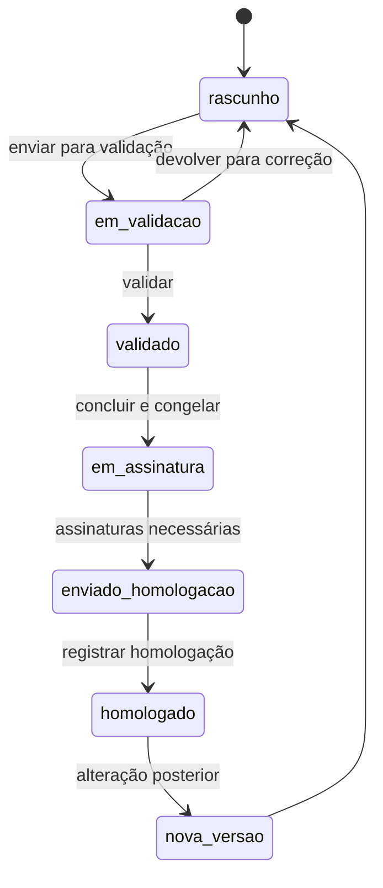

# Migração para a referência 10.2

## Escopo e proteção das referências

A pasta `Gerador de PPP V6.5/Gerador de PPP v10.2/` ? a refer?ncia recebida e n?o ? destino de c?digo. Ela ? a ?nica refer?ncia operacional da aplica??o.

`apps/web/scripts/prepare-reference.mjs` copia o HTML v10.2 e compara seu hash SHA-256 antes de preparar a aplica??o. A c?pia de trabalho ? `apps/web/prototipo.html`, que ? a rota principal do Vite.

| Referência | Origem | Hash SHA-256 |
| --- | --- | --- |
| 10.2 | `Gerador de PPP V6.5/Gerador de PPP v10.2/Gerador de PPP.html` | `a9c6a6ed26939d2755a09592d3d3e34515988ff9ce64445a713eb691715fc52e` |

## Alterações relevantes da 10.2

A 10.2 organiza o percurso em 39 telas e dez módulos. A identificação (`t02`) passa a abrir o percurso. Os identificadores de tela são estáveis e devem ser persistidos, pois sua posição mudou.

| Elemento | Efeito na aplicação Supabase |
| --- | --- |
| Tela `t00b` — legislação | Nova tela formativa; não cria resposta escolar, mas integra trilha e conteúdo curável. |
| Tela `tBal` — balanço | Condicional para revisão. Lê objetivos e indicadores da versão anterior e grava `tBalanco`. |
| Justificativa | `tJustificativa` passa a ser preenchido junto com apresentação e histórico. |
| Currículo e avaliação | Ativa `tOrganizacaoTrabalho` e `tAceleracao`. |
| Convivência | Mantém a tela formativa `tConvF` e a escrita `tConv`, com `tConvivencia`. |
| Gestão | Mantém a escrita `tProf`, com `tArticulacao` e `tDecisorio`. |
| Fechamento | Inclui `tAvaliacaoInstitucional`, `tOutrosAspectos` e `tReferencias`. |
| Identificação | Inclui código INEP do Censo, que vem da base da escola e não deve ser digitado pela direção. |
| Conteúdo institucional | Remove parâmetros `{{REDE.*}}`; a referência legal passa a ser texto editável por caminho. |
| Documento oficial | Capa, sumário com páginas, Padrão Ofício, Carlito, brasão, rodapé de autenticidade e folha de assinaturas. |

## Migrations já aplicadas na rota v10.2

| Migration | Resultado |
| --- | --- |
| `20260922001800_preparar_percurso_v102.sql` | Inclui o código INEP do Censo no cadastro e no snapshot do PPP; aceita chaves de tela da v10.2 na retomada. |
| `20260922001900_listar_ppps_do_painel.sql` | Cria a consulta paginada e autorizada do painel, com progresso calculado pelas tarefas persistidas. |
| `20260922002000_proteger_criacao_de_rascunho.sql` | Impede duas versões em rascunho para a mesma escola, inclusive por requisições simultâneas. |
| `20260922002100_preencher_identificacao_inicial.sql` | Cria o snapshot institucional inicial a partir de `escolas` e `regionais_ensino`. |
| `20260922002200_detalhar_catalogos_pedagogicos.sql` | Acrescenta referência, texto documental, texto formativo e orientações relacionais aos itens de catálogo. |
| `20260922002300_importar_catalogos_v102.sql` | Importa os seis catálogos da referência v10.2, gerada por `prepare:catalogs:v102`. |

Campos textuais e opções que já existem no banco serão reutilizados. A migração não transformará o formulário em uma tabela plana de colunas.

## Mapeamento de persistência

| Domínio 10.2 | Destino Supabase | Ação prevista |
| --- | --- | --- |
| Identificação, vigência e Censo | `identificacoes_ppp` | `codigo_inep_censo` foi incluído pela migration `20260922001800` e é preenchido a partir de `escolas`. |
| Textos `t*` | `textos_ppp` | Manter uma linha por chave estável; ampliar a validação de chaves da 10.2. |
| Etapas e modalidades | `ofertas_ensino_ppp` | Publicar catálogo 10.2 e preservar o código do item selecionado. |
| Infraestrutura, temas, princípios e métodos | `opcoes_pedagogicas_ppp` | Publicar catálogo 10.2, com ordem, rótulo, referência, texto e situação. |
| Detalhes condicionais de modalidades | `detalhes_ppp` | Persistir uma linha por grupo e campo, sem JSON persistente. |
| Indicadores e balanço | `indicadores_educacionais_ppp` e `detalhes_ppp` | Relacionar o balanço à versão anterior e conservar o valor histórico consultado. |
| Tarefas obrigatórias e condicionais | `tarefas_revisoes_ppp` e `tarefas_progresso_ppp` | Criar catálogo de tarefas da 10.2 e validar dependências no banco e na interface. |
| Conteúdo curável | `publicacoes_institucionais` e `itens_publicacao_institucional` | Importar caminhos, grupos e textos da 10.2; congelar a publicação usada por cada revisão. |
| Assinaturas, ata, anexos e homologação | `participantes_ppp`, `arquivos_ppp` e `eventos_ppp` | Criar regras transacionais e estados completos; metadados no banco e binários no Storage privado. |

## Estados e transições alvo

A nomenclatura física atual permanece em português simples, e a interface recebe o rótulo da referência.

`homologado` é definitivo. Não haverá rota de desfazer homologação. Uma nova versão cria protocolo e revisão próprios sem sobrescrever o documento homologado.

## Ordem de implementação

1. **Refer?ncia e compatibilidade**: preparar a c?pia de trabalho v10.2, com os arquivos montados sem altera??es e um adaptador pr?prio. Conclu?do.
2. **Persistência do percurso**: adicionar Censo, mapa de telas 10.2, tarefas condicionais, catálogo e leitura da versão anterior para revisão.
3. **Interface escolar**: migrar tela por tela para a cópia de trabalho 10.2, começando por identificação, início, legislação, balanço e retomada.
4. **Documento e PDF**: portar a estrutura de páginas, fonte, brasão, sumário e rodapé; substituir a prévia simplificada por renderização oficial antes de congelar versões.
5. **Workflow institucional**: validação regional, devolução, participantes, presença, assinatura, ata, anexos e homologação definitiva.
6. **Acessos e gestão da rede**: carga de escolas, vínculos históricos, convites, papéis, painéis regional/central e RLS equivalente.
7. **Curadoria**: carga dos 1.070 textos, revisão por publicação, histórico e busca dos 53 textos com referência legal provisória.
8. **Operação**: autenticidade pública sem enumeração, auditoria, retenção, backups, integridade e testes de regressão visual e de RLS.

## Compatibilidade de rascunhos

- A retomada continuará pela chave da tela, como `t02` ou `t20`, e não pelo índice da matriz `TELAS`.
- Respostas já gravadas em `textos_ppp`, opções, indicadores e detalhes serão reaplicadas na tela correspondente.
- Campos que não existiam no rascunho permanecem vazios e aparecem como pendentes. Nenhum texto será inventado.
- Rascunhos existentes s?o retomados pelas chaves est?veis das telas e pelos dados estruturados. N?o existe rota ou contrato v6.5 ativo.

## Decisões pendentes antes do PDF oficial

- A 10.2 exige documento oficial com paginação fiel, Carlito e fonte embutida. A recomendação é usar um serviço de renderização controlado pelo backend, e não imagens de tela no navegador.
- A referência imprime MASP na folha pública de assinaturas. Antes da publicação externa, a regra precisa de validação jurídica e de LGPD.
- O login Google já adotado no projeto será mantido. O fluxo de senha e primeiro acesso do Apps Script não será migrado enquanto não houver necessidade de contas sem Google.
